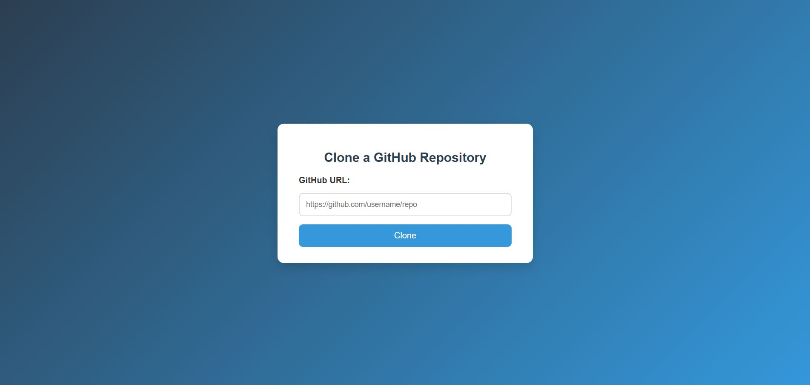
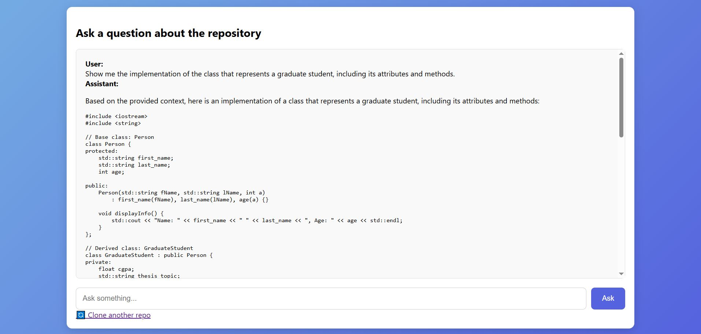
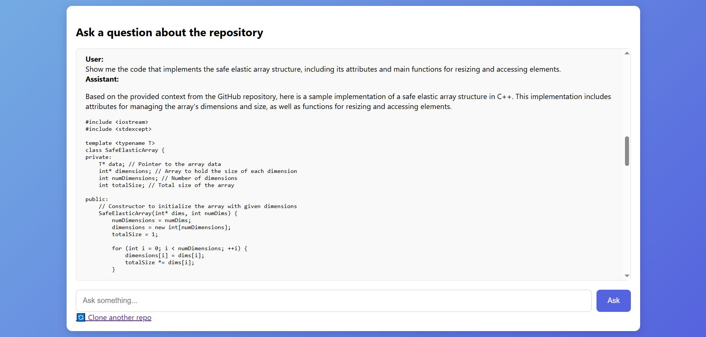

# GitSleuth
## Project Overview
GitSleuth is a Flask-based web application that allows users to interactively explore and query GitHub repositories using RAG (Retrieval-Augmented Generation) powered by ChromaDB and OpenAI’s LLMs.

## Key Features

- **Clone GitHub Repositories**
    - User enters a GitHub URL.
    - Repo is cloned locally (if not already cloned).
    - Prevents duplicate cloning by checking if the repo already exists.
- **Vector Indexing of Source Files**
    - Scans the repo for relevant files (.py, .js, .ts, .md).
    - Extracts file content and metadata (file paths).
    - Stores embeddings in ChromaDB using text-embedding-3-small.
- **Query with RAG Pipeline**
    - User can ask natural language questions about the repository.
    - The app retrieves the most relevant repo files from ChromaDB.
    - Context is passed to OpenAI’s GPT-4o-mini for generating answers.
- **Conversational Interface**
    - Maintains chat history in the Flask session.
    - User sees previous queries and assistant responses.
    - Chatbox is scrollable and styled for readability.

## Tech Stack
- Backend: Flask (Python)
- Vector DB: ChromaDB (for embeddings & retrieval)
- LLM: OpenAI GPT-4o-mini (with embeddings from text-embedding-3-small)
- Frontend: HTML, CSS 

## Workflow
- Input GitHub URL → Repo is cloned locally.
- Indexing → Extract source code & docs, generate embeddings, and store in ChromaDB.
- Ask Queries → User asks a question.
- Retrieval → Relevant repo files are fetched from ChromaDB.
- Answer Generation → Context + question is fed to OpenAI LLM → Answer returned.
- Chat History → Displayed in a scrollable chatbox.

## Usage
- **Clone the Repository**
    ```bash
    git clone https://github.com/yourusername/GitSleuth.git
    cd GitSleuth
    ```
- **Set Up Environment Variables**
    - Create a `.env` file in the project root.
    - Add your OpenAI API key:
    ```
    OPENAI_API_KEY=your_openai_api_key_here
    ```
- **Run the Application**
    ```bash
    python app.py
    ```
## Application Walkthrough


